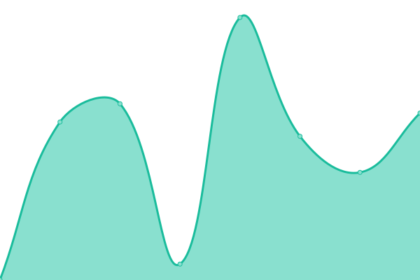

# [📈 Live Status](https://ddebrosse.github.io/mtc): <!--live status--> **🟩 All systems operational**

This repository contains the open-source uptime monitor and status page for [debrosse](https://ddebrosse.github.io/mtc), powered by [Upptime](https://github.com/upptime/upptime).

With [Upptime](https://upptime.js.org), you can get your own unlimited and free uptime monitor and status page, powered entirely by a GitHub repository. We use [Issues](https://github.com/ddebrosse/mtc/issues) as incident reports, [Actions](https://github.com/ddebrosse/mtc/actions) as uptime monitors, and [Pages](https://ddebrosse.github.io/mtc) for the status page.

<!--start: status pages-->
<!-- This summary is generated by Upptime (https://github.com/upptime/upptime) -->
<!-- Do not edit this manually, your changes will be overwritten -->
<!-- prettier-ignore -->
| URL | Status | History | Response Time | Uptime |
| --- | ------ | ------- | ------------- | ------ |
|  [Miteco](https://www.miteco.gob.es/) | 🟩 Up | [miteco.yml](https://github.com/ddebrosse/mtc/commits/HEAD/history/miteco.yml) | 

 1329ms
     
 | 

<a href="https://ddebrosse.github.io/mtc/history/miteco">100.00%</a>
    

|  [PRTR](https://www.prtr.miteco.gob.es/) | 🟩 Up | [prtr.yml](https://github.com/ddebrosse/mtc/commits/HEAD/history/prtr.yml) | 

 1261ms
     
 | 

<a href="https://ddebrosse.github.io/mtc/history/prtr">100.00%</a>
    

|  [Albufeira](https://www.cadc-albufeira.eu/) | 🟩 Up | [albufeira.yml](https://github.com/ddebrosse/mtc/commits/HEAD/history/albufeira.yml) | 

 882ms
     
 | 

<a href="https://ddebrosse.github.io/mtc/history/albufeira">100.00%</a>
    

|  [RIOCC](https://www.lariocc.es/) | 🟩 Up | [riocc.yml](https://github.com/ddebrosse/mtc/commits/HEAD/history/riocc.yml) | 

 864ms
     
 | 

<a href="https://ddebrosse.github.io/mtc/history/riocc">100.00%</a>
    

<!--end: status pages-->

[**Visit our status website →**](https://ddebrosse.github.io/mtc)

## 📄 License

- Powered by: [Upptime](https://github.com/upptime/upptime)
- Code: [MIT](./LICENSE) © [debrosse](https://ddebrosse.github.io/mtc)
- Data in the `./history` directory: [Open Database License](https://opendatacommons.org/licenses/odbl/1-0/)
